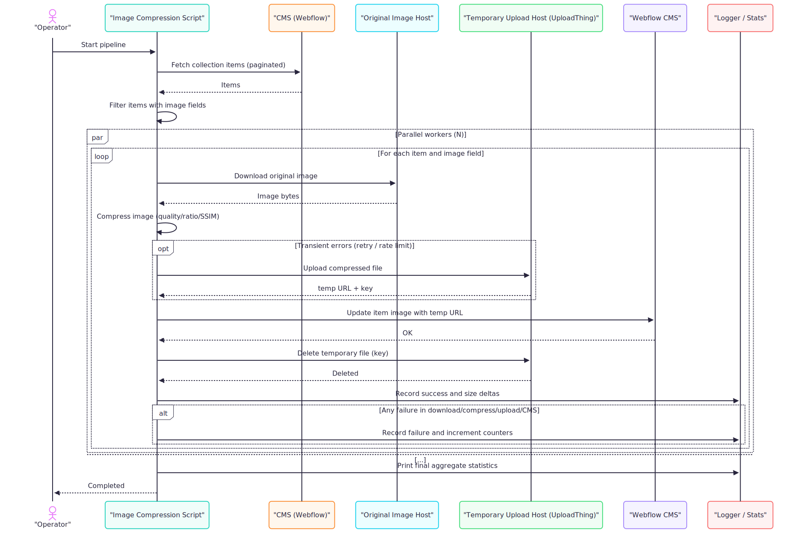

## Webflow CMS Image Compression Pipeline

This service fetches CMS items, downloads their images, compresses them with quality safeguards, updates the CMS to point at a temporary hosted asset, and then cleans up the temporary upload once Webflow has copied the file.

### Architecture Overview

See the UML diagram for the end-to-end flow:



Notes:
- Items are processed concurrently with a configurable worker count.
- API calls use retry with backoff on rate limits.
- Temporary uploads are cleaned up immediately after Webflow copies the image.


### Requirements

- Node.js 18+
- Valid credentials:
  - `WEBFLOW_TOKEN` (API token)
  - `WEBFLOW_COLLECTION_ID` (target collection)
  - `UPLOADTHING_TOKEN` (UploadThing API token)

### Environment Variables

- `IMAGE_FIELD_NAMES` (comma-separated list) — names of image fields to process. These must match the field keys present in `item.fieldData`.
- `ITEM_NAME_FIELD_PATH` — path to item name used for logs (default: `fieldData.name`).
- `IMAGE_OBJECT_FIELD_PATH` — path to the primary image object (default: `fieldData.image`).
- `CONCURRENCY` — number of parallel workers (default: 6).
- Compression tuning:
  - `COMPRESSION_TARGET_RATIO` (default: 0.5)
  - `COMPRESSION_QUALITY` (default: 95)
  - `COMPRESSION_MIN_QUALITY` (default: 80)
  - `COMPRESSION_MIN_SSIM` (default: 0.98)
  - `COMPRESSION_MAX_DIMENSION` (default: 1000)

### Install

```bash
npm install
```

### Run (watch mode)

```bash
npm run dev
```

### Run once (test playground)

Use the playground to try the pipeline against a limited number of items and to simulate failures safely.

```bash
# Process 1 item (default), no simulations
npm run test

# Process N items
TEST_LIMIT=5 npm run test

# Simulate failures for first items in order
TEST_LIMIT=5 SIMULATE=download,compression,upload,cms,delete npm run test
```

### Logs and Stats

- Logs are written to `logs/` with step-by-step progress and final aggregate stats (success rate, size savings).

### Cleanup Behavior

- After a CMS image update succeeds, the temporary upload (UploadThing) is deleted using the returned `key`.

